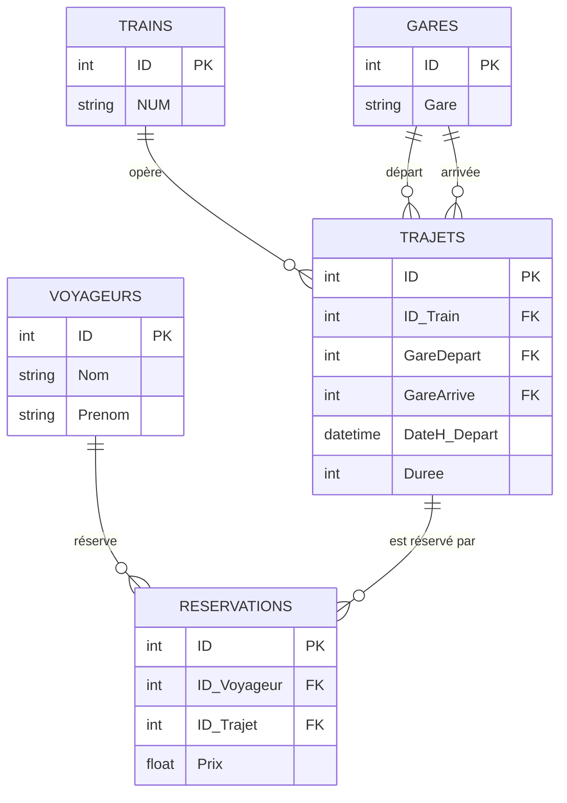

## Schéma de la base de données "Trains"

### Tables

1.  **Voyageurs**

    *   `id_voyageur` INT PRIMARY KEY,
    *   `nom` VARCHAR(255),
    *   `prenom` VARCHAR(255)
2.  **Trains**

    *   `id_train` INT PRIMARY KEY,
    *   `numero_train` VARCHAR(50) UNIQUE
3.  **Trajets**

    *   `id_trajet` INT PRIMARY KEY,
    *   `gare_depart` VARCHAR(255),
    *   `gare_arrivee` VARCHAR(255),
    *   `date_depart` DATE,
    *   `heure_depart` TIME,
    *   `duree` TIME,
    *   `id_train` INT,
    *   FOREIGN KEY (`id_train`) REFERENCES `Trains`(`id_train`)
4.  **Reservations**

    *   `id_reservation` INT PRIMARY KEY,
    *   `id_voyageur` INT,
    *   `id_trajet` INT,
    *   `prix` DECIMAL(10, 2),
    *   FOREIGN KEY (`id_voyageur`) REFERENCES `Voyageurs`(`id_voyageur`),
    *   FOREIGN KEY (`id_trajet`) REFERENCES `Trajets`(`id_trajet`),
    *   CONSTRAINT `uq_voyageur_trajet` UNIQUE (`id_voyageur`, `id_trajet`)





Commande création de la base de donnée :

```sql
CREATE TABLE Voyageurs (
        IDvoyageur INT NOT NULL AUTO_INCREMENT PRIMARY KEY,
        Nom VARCHAR(255) NOT NULL,
        Prenom VARCHAR(255) NOT NULL
) ;

INSERT INTO Voyageurs (Prenom, Nom) VALUES ('Pedro', 'Rommel') ;
INSERT INTO Voyageurs (Prenom, Nom) VALUES ('Kevin', 'Lamontagne') ;
INSERT INTO Voyageurs (Prenom, Nom) VALUES ('Aria', 'Lamontagne') ; 
INSERT INTO Voyageurs (Prenom, Nom) VALUES ('Patricia', 'Raimbaut') ;

SELECT * FROM Voyageurs ;

-- DELETE FROM Voyageurs WHERE IDvoyageur >= 4 ;

ALTER TABLE Voyageurs ADD UNIQUE (Nom, Prenom) ;

-- UPDATE Voyageurs SET Nom = 'Rambo' WHERE IDvoyageur = 11 ;

CREATE TABLE Gares (
	IDgare INT NOT NULL AUTO_INCREMENT PRIMARY KEY,
	Gare VARCHAR(255) NOT NULL UNIQUE
) ;


INSERT INTO Gares (Gare) VALUES ('Paris') ;
INSERT INTO Gares (Gare) VALUES ('Mulhouse') ;
INSERT INTO Gares (Gare) VALUES ('Toulouse') ;
INSERT INTO Gares (Gare) VALUES ('Marseille') ;

CREATE TABLE Trains (
	IDtrain INT NOT NULL AUTO_INCREMENT PRIMARY KEY,
	NumeroTrain VARCHAR(6) NOT NULL UNIQUE
	) ;

INSERT INTO Trains (NumeroTrain) VALUES () ;

INSERT INTO Trains (NumeroTrain) VALUES ('KR2245'); 
INSERT INTO Trains (NumeroTrain) VALUES ('PY7532'); 
INSERT INTO Trains (NumeroTrain) VALUES ('ZQ4782'); 
INSERT INTO Trains (NumeroTrain) VALUES ('ZQ2111');

CREATE TABLE Trajets (
	IDtrajet INT NOT NULL AUTO_INCREMENT PRIMARY KEY,
	IDtrain INT NOT NULL,
	IDgareDepart INT NOT NULL,
	IDgareArrivee INT NOT NULL,
	DateHeureDepart DATETIME NOT NULL,
	Duree TIME NOT NULL,
) ;

INSERT INTO Trajets (IDtrain, IDgareDepart, IDgareArrivee, DateHeureDepart, Duree)
VALUES (1,1,2, '2024-09-16 11:28:00', '03:11') ;

SELECT * FROM Trajets ;

UPDATE Trajets SET IDgareArrivee = 4 WHERE IDgareArrivee = 444;

ALTER TABLE Trajets ADD FOREIGN KEY (IDgareDepart) REFERENCES Gares (IDgare) ;
ALTER TABLE Trajets ADD FOREIGN KEY (IDgareArrivee) REFERENCES Gares (IDgare) ;
ALTER TABLE Trajets ADD FOREIGN KEY (IDtrain) REFERENCES Trains (IDtrain) ;

CREATE TABLE Reservations (
        IDvoyageur INT NOT NULL,
        IDtrajet INT NOT NULL,
        Prix DECIMAL(5, 2) NOT NULL,
        PRIMARY KEY (IDvoyageur, IDtrajet),
        FOREIGN KEY (IDvoyageur) REFERENCES Voyageurs (ID_voyageur),
        FOREIGN KEY (IDtrajet) REFERENCES Trajets (IDtrajet)
) ;

INSERT INTO Reservations (IDvoyageur, IDtrajet, Prix) VALUES (1,1,255) ;

INSERT INTO Reservations (IDvoyageur, IDtrajet, Prix) VALUES (2,2,312) ;
INSERT INTO Reservations (IDvoyageur, IDtrajet, Prix) VALUES (3,2,312) ;
INSERT INTO Reservations (IDvoyageur, IDtrajet, Prix) VALUES (11,5,202) ;
INSERT INTO Reservations (IDvoyageur, IDtrajet, Prix) VALUES (1,5,350) ;

--- la liste des voyageurs 
Select **
From Voyageurs
Where Nom LIKE 'L%' ;

 -- ... idem, avec le prix des réservations

Select *
From Voyageurs AS V
	INNER JOIN Reservations AS R on V.IDvoyageurs = R.IDvoyageur
Where Nom LIKE 'L%' ;

-- ... idem avec date-heure de départ et durée et date-heure d'arrivée
Select Nom, Prenom, Prix, DateHeureDepart, Duree, ADDTIME(DateHeureDepart, Duree)
From Voyageurs AS V
	INNER JOIN Reservations AS R ON V.IDvoyageur = R.IDvoyageur
	INNER JOIN Trajets AS T ON R.IDtrajet = T.IDtrajet
Where Nom LIKE 'L%';

-- ... idem, avec le numéro de train

Select Nom, Prenom, Prix, DateHeureDepart, Duree,
	ADDTIME(DateHeureDepart, Duree) AS DateHeureArrivee,
	Tn.NumeroTrain
From Voyageurs AS V
	INNER JOIN RESERVATIONS AS R ON V.IDvoyageur = R.IDvoyageur
	INNER JOIN Trajets AS T ON R.IDtrajet = T.IDtrajet
	INNER JOIN Trains AS Tn ON T.IDtrain = Tn.train
	INNER JOIN Gares AS GD ON GD.IDgare = T.IDgareDepart
	INNER JOIN Gares AS GA ON GA.IDgare = T.IDgareArrivee
WHERE Nom LIKE 'L%'

CREATE OR REPLACE VIEW V_voyage AS
SELECT 
    V.IDvoyageur,
    V.Nom,
    V.Prenom,
    R.Prix,
    T.DateHeureDepart,
    T.Duree,
    ADDTIME(T.DateHeureDepart, T.Duree) AS DateHeureArrivee,
    Tr.NumeroTrain
FROM Voyageurs AS V
JOIN Reservations AS R ON V.IDvoyageur = R.IDvoyageur
JOIN Trajets AS T ON R.IDtrajet = T.IDtrajet
JOIN Trains AS Tr ON T.IDtrain = Tr.IDtrain;

-- Exemple d'utilisation : total dépensé par voyageur
SELECT 
    Nom,
    Prenom,
    SUM(Prix) AS TotalDepense
FROM V_voyage
GROUP BY Nom, Prenom
ORDER BY TotalDepense DESC;

-- créer une vue qui donne les infos du panneau d'affichage :
-- Heure départ, Numéro du train, Gare de départ, Gare d'arrivée, Heure d'arrivée
-- trier par ordre chronologique de départ

CREATE OR REPLACE VIEW V_PanneauAffichage AS
SELECT 
    T.DateHeureDepart AS HeureDepart,
    Tr.NumeroTrain,
    GD.Gare AS GareDepart,
    GA.Gare AS GareArrivee,
    ADDTIME(T.DateHeureDepart, T.Duree) AS HeureArrivee
FROM 
    Trajets T
    JOIN Trains Tr ON T.IDtrain = Tr.IDtrain
    JOIN Gares GD ON T.IDgareDepart = GD.IDgare
    JOIN Gares GA ON T.IDgareArrivee = GA.IDgare
ORDER BY 
    T.DateHeureDepart;
```


